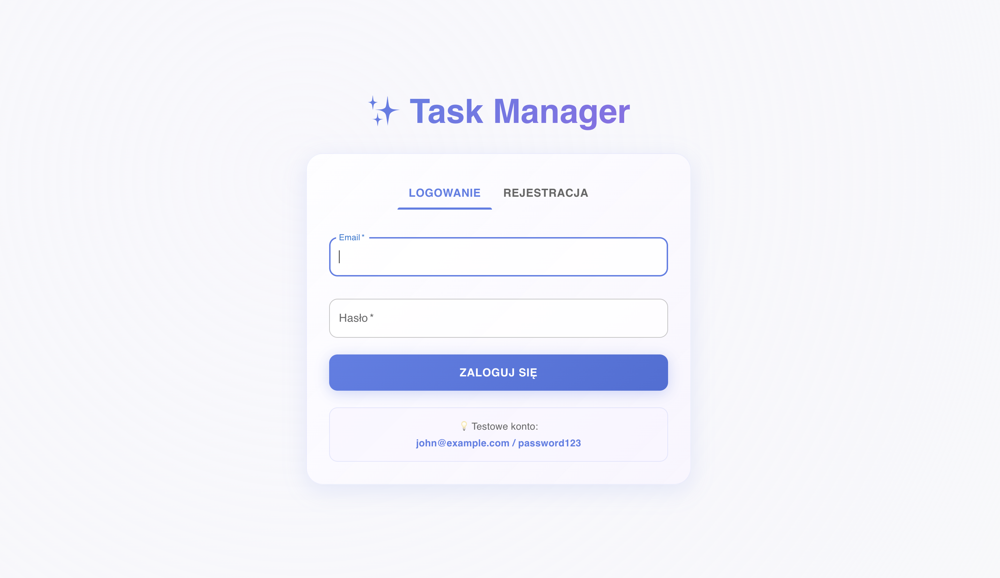
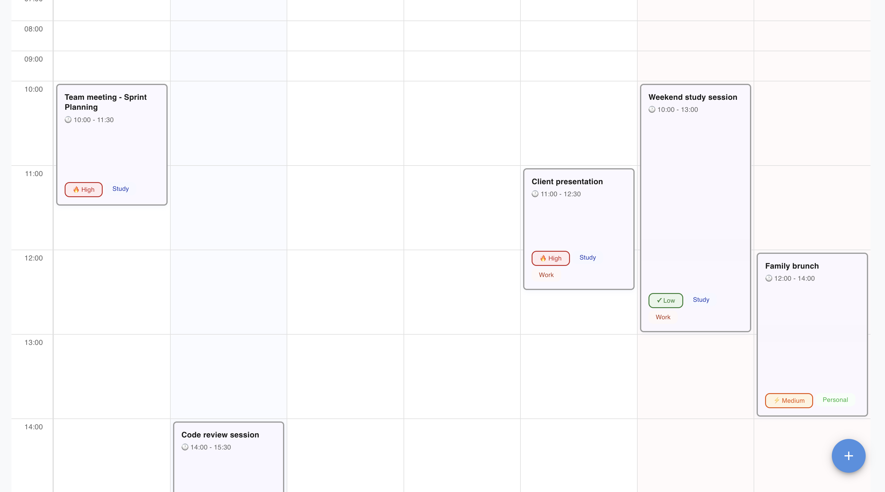
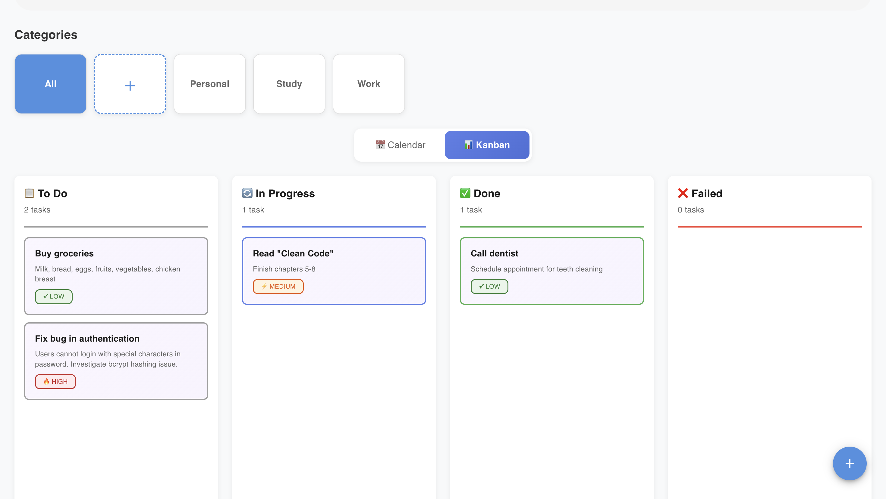
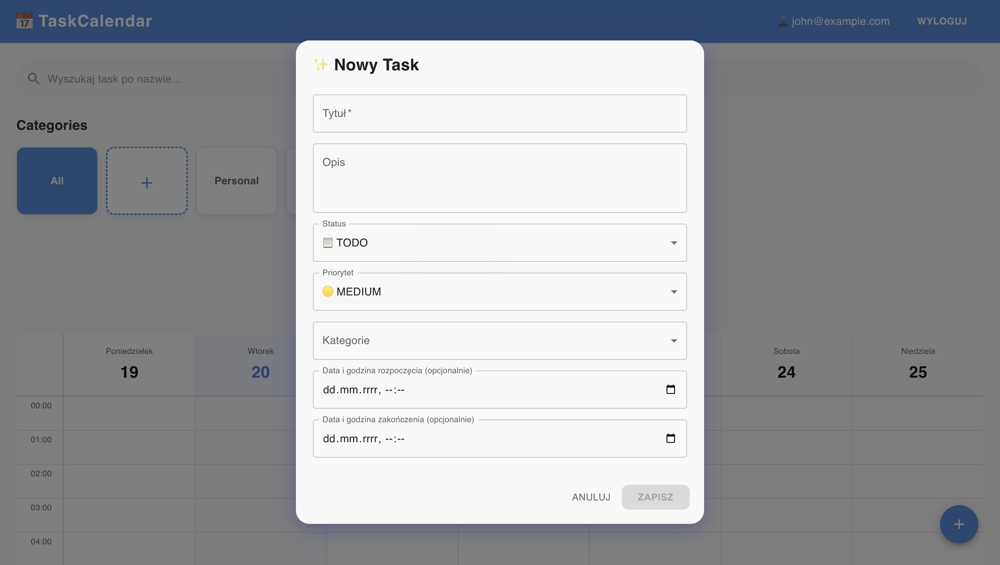

# Task Manager - Aplikacja do Zarządzania Zadaniami

## 1. Wprowadzenie

### Opis projektu
Task Manager to aplikacja webowa do zarządzania zadaniami, łącząca w sobie funkcjonalności kalendarza i tablicy Kanban. Aplikacja pozwala użytkownikom efektywnie organizować swoje zadania zarówno w kontekście czasowym, jak i statusowym.

### Cel aplikacji
Głównym celem aplikacji jest dostarczenie intuicyjnego narzędzia do planowania i śledzenia zadań, które łączy:
- **Widok kalendarzowy** - dla zadań z określonym czasem wykonania
- **Widok Kanban** - dla zadań bez określonego czasu, organizowanych według statusu

### Kluczowe funkcje i możliwości
- ✅ **Dual-view system** - przełączanie między widokiem kalendarza a Kanban
- ✅ **Autentykacja użytkowników** - bezpieczne logowanie i rejestracja z JWT
- ✅ **Zarządzanie zadaniami** - tworzenie, edycja, usuwanie zadań
- ✅ **Priorytety zadań** - LOW, MEDIUM, HIGH z wizualnymi wskaźnikami
- ✅ **Statusy zadań** - TODO, IN_PROGRESS, DONE, FAILED
- ✅ **Walidacja czasowa** - zapobieganie nakładaniu się zadań
- ✅ **Wyszukiwanie i filtrowanie** - po nazwie i kategorii

---

## 2. Wykorzystane technologie

### Backend
- **Node.js** (v18+) - środowisko uruchomieniowe JavaScript
- **NestJS** (v11.0.1) - progresywny framework Node.js
- **TypeScript** (v5.x) - JavaScript
- **TypeORM** (v0.3.28) - ORM do zarządzania bazą danych
- **PostgreSQL** (v15) - relacyjna baza danych
- **JWT** (@nestjs/jwt) - autentykacja tokenowa
- **bcrypt** - hashowanie haseł
- **class-validator** - walidacja DTO
- **Swagger** - dokumentacja API

### Frontend
- **React** (v19.2.0) - biblioteka UI
- **TypeScript** (v5.x) - JavaScript
- **Vite** (v6.0.11) - build tool
- **Material-UI** (v7.3.6) - komponenty UI
- **Axios** - klient HTTP
- **React Router** (v7.5.0) - routing

### DevOps
- **Docker** & **Docker Compose** - konteneryzacja
- **ESLint** - linting kodu
- **Git** - kontrola wersji

---

## 3. Instalacja

### Wymagania wstępne
- **Node.js** >= 18.0.0
- **npm** >= 9.0.0
- **Docker** >= 20.10.0
- **Docker Compose** >= 2.0.0
- **Git**

### Klonowanie repozytorium
```bash
git clone https://github.com/Xemuuu/todoapp
cd todoapp
```

### Kroki instalacji

#### 1. Uruchomienie aplikacji (Docker)
```bash
# Z głównego katalogu projektu uruchom wszystkie serwisy
docker-compose up -d

# Backend: http://localhost:3000
# Frontend: http://localhost:5173
# PostgreSQL: localhost:5432
```

#### 2. Seed bazy danych (opcjonalnie)
```bash
# Wykonaj seed w kontenerze backendu (tworzy testowe konto z przykładowymi danymi)
docker exec todoapp-backend-1 npm run seed

# Testowe konto:
# Email: john@example.com
# Hasło: password123
```

**Uwaga:** Dokumentacja API (Swagger) dostępna pod: `http://localhost:3000/api`

---

## 4. Instrukcje użytkowania

### Pierwsze uruchomienie

#### Logowanie z testowym kontem
- **Email**: `john@example.com`
- **Hasło**: `password123`
- **Zawartość**: Konto zawiera seedowane przykładowe zadania (7 w kalendarzu, 7 w Kanban) oraz 3 kategorie

#### Rejestracja nowego konta
1. Kliknij zakładkę "Rejestracja"
2. Wprowadź email i hasło (dwukrotnie)
3. Kliknij "Zarejestruj się"
- **Zawartość**: Nowe konto jest puste - brak zadań i kategorii

### Główne funkcjonalności

#### 1. Widok Kalendarza
- Wyświetla zadania z określonym czasem w formacie tygodniowym
- **Nawigacja**: Strzałki ← → do przełączania tygodni
- **Edycja**: Kliknięcie na zadanie otwiera dialog edycji

#### 2. Widok Kanban
- Wyświetla zadania bez określonego czasu w 4 kolumnach:
  - 📋 **To Do** - zadania do wykonania
  - 🔄 **In Progress** - zadania w trakcie
  - ✅ **Done** - zadania zakończone
  - ❌ **Failed** - zadania nieudane

#### 3. Tworzenie zadania
1. Kliknij przycisk **+** (prawy dolny róg)
2. Wypełnij formularz:
   - **Tytuł** (wymagany)
   - **Opis** (opcjonalny)
   - **Status**: TODO, IN_PROGRESS, DONE, FAILED
   - **Priorytet**: LOW (🟢), MEDIUM (🟡), HIGH (🔴)
   - **Kategorie** (opcjonalne)
   - **Data/czas rozpoczęcia i zakończenia** (opcjonalne):
     - Jeśli podane → zadanie trafia do kalendarza
     - Jeśli puste → zadanie trafia do Kanban
     - **Przełączanie między widokami**:
       - Dodanie daty do zadania z Kanban → przenosi do kalendarza
       - Usunięcie daty z zadania w kalendarzu → przenosi do Kanban
3. Kliknij "Zapisz"

#### 4. Kategorie
- Kliknij przycisk **+** w sekcji kategorii
- Wybierz nazwę i kolor (16 predefiniowanych kolorów)
- Kategorie są unikalne dla każdego użytkownika

#### 5. Wyszukiwanie i filtrowanie
- **Wyszukiwanie**: Wpisz tekst w pole "Wyszukaj task po nazwie..."
- **Filtr kategorii**: Kliknij chip kategorii aby pokazać tylko te zadania

### Zrzuty ekranu

#### Strona logowania

*Widok strony logowania*

#### Widok kalendarza

*Widok strony kalendarza*

#### Widok Kanban

*Widok tablicy Kanban*

#### Dialog zadania

*Widok formularza zadania*

---

## 5. Kod i konfiguracja

### Repozytorium GitHub
Kod źródłowy dostępny na: [GitHub Repository](https://github.com/Xemuuu/todoapp)

### Konfiguracja środowiska

#### Backend (.env)
```env
# Database
DB_HOST=localhost
DB_PORT=5432
DB_USERNAME=postgres
DB_PASSWORD=postgres
DB_NAME=db_todoapp

# API
PORT=3000
API_KEY=your-super-secret-api-key-2026

# JWT
JWT_SECRET=your-jwt-secret-key-2026
JWT_EXPIRES_IN=7d
```

#### Frontend (.env)
```env
VITE_API_URL=http://localhost:3000
VITE_API_KEY=your-super-secret-api-key-2026
```

#### Docker Compose (domyślna konfiguracja)
```yaml
services:
  db:
    image: postgres:15-alpine
    container_name: todoapp-db
    environment:
      POSTGRES_USER: postgres
      POSTGRES_PASSWORD: postgres
      POSTGRES_DB: db_todoapp
    ports:
      - "5432:5432"
    volumes:
      - postgres_data:/var/lib/postgresql/data
```

---

## 6. Kluczowe funkcjonalności

### 6.1. Autentykacja użytkowników (JWT)
- **Rejestracja**: Hashowanie haseł za pomocą bcrypt (10 salt rounds)
- **Logowanie**: Generowanie JWT tokena z 7-dniową ważnością
- **Session management**: Token przechowywany w localStorage
- **Auto-logout**: Automatyczne przekierowanie na stronę logowania przy wygaśnięciu tokenu (401)
- **Protected routes**: Guard na endpointach backendu wymagających autentykacji

### 6.2. REST API - Endpointy

**Autentykacja:**
- `POST /auth/register` - Rejestracja (email, password)
- `POST /auth/login` - Logowanie (zwraca token JWT + dane użytkownika)

**Zadania:**
- `GET /tasks` - Lista zadań użytkownika (z filtrowaniem i paginacją)
- `POST /tasks` - Tworzenie nowego zadania
- `GET /tasks/:id` - Szczegóły pojedynczego zadania
- `PATCH /tasks/:id` - Aktualizacja zadania (wszystkie pola opcjonalne)
- `DELETE /tasks/:id` - Usuwanie zadania

**Kategorie:**
- `GET /categories` - Lista kategorii użytkownika
- `POST /categories` - Tworzenie nowej kategorii (name, color)

**Dokumentacja API**: Swagger dostępny pod `http://localhost:3000/api`

### 6.3. Walidacja danych
- **DTO (Data Transfer Objects)**: Walidacja na poziomie backendu za pomocą `class-validator`
- **Dekoratory walidacyjne**: 
  - `@IsEmail()` - walidacja formatu email
  - `@IsDateString()` - walidacja formatów dat (ISO 8601)
  - `@IsEnum()` - walidacja wartości enum (status, priorytet)
  - `@ValidateIf()` - warunkowa walidacja (np. puste stringi dla dat)
- **Walidacja konfliktów**: Sprawdzanie nakładania się zadań w kalendarzu
- **Obsługa błędów**: Automatyczne zwracanie `400 Bad Request` z listą błędów walidacji

### 6.4. Interceptory i middleware
- **TransformInterceptor**: Opakowuje wszystkie response'y w standardowy format:
  ```json
  {
    "success": true,
    "data": { /* dane */ },
    "timestamp": "2026-01-26T12:00:00.000Z",
    "path": "/tasks"
  }
  ```
- **ApiKeyGuard**: Walidacja klucza API (`X-API-KEY` header) na wszystkich endpointach
- **JwtAuthGuard**: Weryfikacja tokena JWT i ekstrakcja danych użytkownika
- **Axios interceptor (frontend)**: Automatyczne dodawanie `userId` do query params (z wyłączeniem `/auth/*`)

### 6.5. Zabezpieczenia
- **API Key**: Wymagany header `X-API-KEY` na wszystkich endpointach
- **JWT Authentication**: Bearer token w headerze `Authorization` (oprócz endpointów `/auth/*`)
- **User scoping**: Każde zapytanie automatycznie filtrowane po `userId` - użytkownik widzi tylko swoje dane
- **Password hashing**: Hasła hashowane bcrypt przed zapisem do bazy
- **CORS**: Konfiguracja allowed origins dla bezpiecznej komunikacji frontend-backend

### 6.6. Dual-view system (Unikalna funkcjonalność)

System automatycznego routingu zadań między dwoma widokami oparty na obecności pól datetime:

**Mechanizm działania:**
- **Zadania z czasem** - posiadające wartości `startDateTime` i `endDateTime` wyświetlane w **widoku kalendarza**
- **Zadania bez czasu** - z wartościami `null` dla datetime wyświetlane w **widoku Kanban**

**Dynamiczne przełączanie:**
- Dodanie dat do zadania z Kanban → automatyczny transfer do kalendarza
- Usunięcie dat z zadania w kalendarzu → automatyczny transfer do Kanban
- Implementacja: walidacja `@ValidateIf()` pozwala na puste stringi, które konwertowane są na `null` w serwisie

**Backend (TypeORM Entity):**
```typescript
@Column({ type: 'timestamp', nullable: true })
startDateTime: Date | null;

@Column({ type: 'timestamp', nullable: true })
endDateTime: Date | null;
```

**Frontend (filtrowanie w TasksPage):**
- `tasksWithTime` - filtr: `task.startDateTime && task.endDateTime`
- `tasksWithoutTime` - filtr: `!task.startDateTime && !task.endDateTime`

**Walidacja czasowa:**
- Zadania z czasem: wymagane oba pola (start + end)
- Sprawdzanie nakładania się zadań w kalendarzu
- Data zakończenia musi być późniejsza niż data rozpoczęcia

---

## 7. Struktura kodu

### Model danych - Schemat bazy danych

#### ER Diagram
```
┌─────────────┐         ┌──────────────┐                    ┌─────────────┐
│    User     │         │     Task     │                    │  Category   │
├─────────────┤         ├──────────────┤                    ├─────────────┤
│ id (PK)     │────────<│ userId (FK)  │                    │ id (PK)     │
│ email       │    1:N  │ id (PK)      │                    │ name        │
│ password    │         │ title        │                    │ color       │
│ created_at  │         │ description  │                    │ userId (FK) │
│ updated_at  │         │ status       │                    │             │
└─────────────┘         │ priority     │                    └─────────────┘
                        │ startDateTime│                         ▲
                        │ endDateTime  │                         │
                        │ created_at   │                         │
                        │ updated_at   │                         │
                        └──────────────┘                         │
                               │                                 │
                               │        ┌──────────────────┐     │
                               │        │ task_categories  │     │
                               │        │ (junction table) │     │
                               │        ├──────────────────┤     │
                               └───────>│ task_id (FK, PK) │     │
                                  N:M   │ category_id (FK) │<────┘
                                        └──────────────────┘
```

#### Tabela: users
| Kolumna    | Typ         | Opis                           |
|------------|-------------|--------------------------------|
| id         | SERIAL PK   | Unikalny identyfikator         |
| email      | VARCHAR     | Email użytkownika (unique)     |
| password   | VARCHAR     | Hashowane hasło (bcrypt)       |
| created_at | TIMESTAMP   | Data utworzenia konta          |
| updated_at | TIMESTAMP   | Data ostatniej aktualizacji    |

#### Tabela: tasks
| Kolumna        | Typ                | Opis                                    |
|----------------|--------------------|-----------------------------------------|
| id             | SERIAL PK          | Unikalny identyfikator                  |
| title          | VARCHAR            | Tytuł zadania                           |
| description    | TEXT               | Szczegółowy opis (nullable)             |
| status         | ENUM               | TODO, IN_PROGRESS, DONE, FAILED         |
| priority       | ENUM               | LOW, MEDIUM, HIGH                       |
| start_date_time| TIMESTAMP          | Początek zadania (nullable)             |
| end_date_time  | TIMESTAMP          | Koniec zadania (nullable)               |
| user_id        | INTEGER FK         | Referencja do users.id                  |
| created_at     | TIMESTAMP          | Data utworzenia                         |
| updated_at     | TIMESTAMP          | Data ostatniej modyfikacji              |

**Uwaga**: `start_date_time` i `end_date_time` są nullable - gdy NULL, task trafia do widoku Kanban.

#### Tabela: categories
| Kolumna    | Typ         | Opis                           |
|------------|-------------|--------------------------------|
| id         | SERIAL PK   | Unikalny identyfikator         |
| name       | VARCHAR     | Nazwa kategorii                |
| color      | VARCHAR(7)  | Kolor w formacie HEX (#FF5733) |
| user_id    | INTEGER FK  | Referencja do users.id         |

#### Tabela: task_categories (Many-to-Many)
| Kolumna     | Typ         | Opis                    |
|-------------|-------------|-------------------------|
| task_id     | INTEGER FK  | Referencja do tasks.id  |
| category_id | INTEGER FK  | Referencja do categories.id |

**Constraint**: Composite Primary Key (task_id, category_id)

### Struktura projektu

```
todoapp/
├── backend/                    # NestJS Backend
│   ├── src/
│   │   ├── auth/              # Moduł autentykacji
│   │   │   ├── auth.controller.ts    # Endpointy login/register
│   │   │   ├── auth.service.ts       # Logika JWT
│   │   │   └── jwt.strategy.ts       # Strategia Passport JWT
│   │   │
│   │   ├── categories/        # Moduł kategorii
│   │   │   ├── categories.controller.ts
│   │   │   ├── categories.service.ts
│   │   │   ├── entities/
│   │   │   │   └── category.entity.ts   # Entity TypeORM
│   │   │   └── dto/
│   │   │       └── create-category.dto.ts
│   │   │
│   │   ├── tasks/             # Moduł zadań
│   │   │   ├── tasks.controller.ts
│   │   │   ├── tasks.service.ts
│   │   │   ├── entities/
│   │   │   │   └── task.entity.ts       # Entity z relacjami
│   │   │   └── dto/
│   │   │       ├── create-task.dto.ts
│   │   │       └── update-task.dto.ts
│   │   │
│   │   ├── users/             # Moduł użytkowników
│   │   │   ├── users.service.ts
│   │   │   └── entities/
│   │   │       └── user.entity.ts
│   │   │
│   │   ├── common/            # Współdzielone elementy
│   │   │   ├── guards/
│   │   │   │   └── api-key.guard.ts     # Guard API Key
│   │   │   └── interceptors/
│   │   │       └── transform.interceptor.ts  # Response wrapper
│   │   │
│   │   ├── app.module.ts      # Główny moduł aplikacji
│   │   ├── main.ts            # Entry point
│   │   └── seed.ts            # Seeding bazy danych
│   │
│   ├── package.json
│   └── tsconfig.json
│
├── frontend/                   # React Frontend
│   ├── src/
│   │   ├── components/        # Komponenty React
│   │   │   ├── WeekView.tsx           # Widok kalendarza
│   │   │   ├── KanbanView.tsx         # Widok Kanban
│   │   │   ├── TaskDialog.tsx         # Dialog zadania
│   │   │   ├── CategoryDialog.tsx     # Dialog kategorii
│   │   │   ├── CategoryFilter.tsx     # Filtry kategorii
│   │   │   ├── SearchBar.tsx          # Wyszukiwarka
│   │   │   └── TopBar.tsx             # Górny pasek nawigacji
│   │   │
│   │   ├── pages/             # Strony aplikacji
│   │   │   ├── LoginPage.tsx          # Strona logowania
│   │   │   └── TasksPage.tsx          # Główna strona z taskami
│   │   │
│   │   ├── context/           # React Context
│   │   │   └── AuthContext.tsx        # Kontekst autentykacji
│   │   │
│   │   ├── services/          # Serwisy API
│   │   │   ├── authService.ts
│   │   │   ├── tasksService.ts
│   │   │   └── categoriesService.ts
│   │   │
│   │   ├── config/
│   │   │   └── api.ts                 # Konfiguracja Axios
│   │   │
│   │   ├── types/
│   │   │   └── index.ts               # TypeScript types
│   │   │
│   │   ├── App.tsx            # Root component
│   │   └── main.tsx           # Entry point
│   │
│   ├── package.json
│   └── vite.config.ts
│
├── docker-compose.yml         # Docker configuration
└── README.md                  # Ten plik
```

### Główne elementy kodu

#### 1. Backend - Task Entity

**Plik**: `backend/src/tasks/entities/task.entity.ts`

Definicja modelu zadania w bazie danych:

```typescript
@Entity('tasks')
export class Task {
  @PrimaryGeneratedColumn()
  id: number;

  @Column()
  title: string;

  @Column({ type: 'text', nullable: true })
  description: string;

  @Column({ type: 'enum', enum: TaskStatus, default: TaskStatus.TODO })
  status: TaskStatus;

  @Column({ type: 'enum', enum: TaskPriority, default: TaskPriority.MEDIUM })
  priority: TaskPriority;

  @Column({ type: 'timestamp', nullable: true })
  startDateTime: Date | null;

  @Column({ type: 'timestamp', nullable: true })
  endDateTime: Date | null;

  @ManyToOne(() => User, (user) => user.tasks)
  @JoinColumn({ name: 'user_id' })
  user: User;

  @ManyToMany(() => Category)
  @JoinTable({ name: 'task_categories' })
  categories: Category[];
}
```

**Co robi**: Model zadania w TypeORM. Pola `startDateTime` i `endDateTime` mają `nullable: true` - jeśli są wypełnione to task idzie do kalendarza, jeśli są null to ląduje w Kanban. Dekorator `@ManyToOne` definiuje relację z userem (każdy task należy do jednego użytkownika), a `@ManyToMany` z kategoriami (task może mieć kilka kategorii, kategoria może być w kilku taskach). TypeORM automatycznie tworzy tabelę pośrednią `task_categories` do obsługi relacji Many-to-Many.

#### 2. Backend - Tasks Service

**Plik**: `backend/src/tasks/tasks.service.ts`

Fragment metody update obsługującej zmianę dat:

```typescript
async update(id: number, userId: number, updateTaskDto: UpdateTaskDto): Promise<Task> {
  const task = await this.findOne(id, userId);
  const { categoryIds, startDateTime, endDateTime, ...taskData } = updateTaskDto;

  Object.assign(task, taskData);
  
  // Pusty string = usuń datę (ustaw null)
  if ('startDateTime' in updateTaskDto) {
    task.startDateTime = (startDateTime && startDateTime.trim()) 
      ? new Date(startDateTime) 
      : null;
  }
  if ('endDateTime' in updateTaskDto) {
    task.endDateTime = (endDateTime && endDateTime.trim()) 
      ? new Date(endDateTime) 
      : null;
  }
  
  // Aktualizacja kategorii
  if (categoryIds !== undefined) {
    if (categoryIds && categoryIds.length > 0) {
      const categories = await this.categoryRepository.findBy({
        id: In(categoryIds),
      });
      task.categories = categories;
    } else {
      task.categories = [];
    }
  }

  return await this.taskRepository.save(task);
}
```

**Co robi**: Pobiera task z bazy sprawdzając czy należy do aktualnego użytkownika. Destrukturyzuje dane z DTO wyciągając categoryIds i daty osobno, resztę pakuje do taskData. Kluczowa część to obsługa dat - sprawdza czy w DTO jest pole startDateTime/endDateTime (operator `in`), jeśli jest to sprawdza czy string nie jest pusty. Jak jest pusty to ustawia null, jak jest wypełniony to parsuje na obiekt Date. Dzięki temu pusty string z frontendu kasuje datę i przenosi task do Kanban. Na końcu aktualizuje kategorie - pobiera je z bazy po ID i przypisuje do taska, TypeORM sam zaktualizuje tabelę pośrednią.

#### 3. Backend - Create Task DTO

**Plik**: `backend/src/tasks/dto/create-task.dto.ts`

Walidacja danych wejściowych:

```typescript
export class CreateTaskDto {
  @IsString()
  @IsNotEmpty()
  title: string;

  @IsString()
  @IsOptional()
  description?: string;

  @IsEnum(TaskStatus)
  @IsOptional()
  status?: TaskStatus;

  @IsEnum(TaskPriority)
  @IsOptional()
  priority?: TaskPriority;

  @ValidateIf((o) => o.startDateTime && o.startDateTime.trim() !== '')
  @IsDateString()
  @IsOptional()
  startDateTime?: string;

  @ValidateIf((o) => o.endDateTime && o.endDateTime.trim() !== '')
  @IsDateString()
  @IsOptional()
  endDateTime?: string;
}
```

**Co robi**: Waliduje dane z frontendu zanim trafią do serwisu. Każde pole ma dekoratory z `class-validator` - `@IsString()` sprawdza czy to string, `@IsNotEmpty()` czy nie jest pusty, `@IsEnum()` czy wartość jest w dozwolonym zbiorze. Kluczowy jest `@ValidateIf()` przy datach - normalnie `@IsDateString()` odrzuciłby pusty string jako błędną datę. Ale `@ValidateIf()` mówi "sprawdź @IsDateString() tylko wtedy gdy pole istnieje i nie jest pustym stringiem". Dzięki temu pusty string przechodzi walidację i trafia do serwisu gdzie konwertuje się na null.

#### 4. Frontend - Axios Interceptor

**Plik**: `frontend/src/config/api.ts`

Automatyczne dodawanie userId do requestów:

```typescript
api.interceptors.request.use((config) => {
  const savedToken = localStorage.getItem('token');
  if (savedToken) {
    config.headers.Authorization = `Bearer ${savedToken}`;
  }
  
  const isAuthEndpoint = config.url?.includes('/auth/');
  const savedUser = localStorage.getItem('user');
  
  if (savedUser && !isAuthEndpoint) {
    const user = JSON.parse(savedUser);
    if (user && user.id) {
      // Do GET/DELETE/PATCH dodaj userId do URL
      if (config.method === 'get' || config.method === 'delete' || config.method === 'patch') {
        config.params = { ...config.params, userId: user.id };
      }
      // Do POST dodaj userId do body
      if (config.method === 'post' && config.data) {
        config.data.userId = user.id;
      }
    }
  }
  return config;
});
```

**Co robi**: Interceptor Axios przechwytuje każdy request przed wysłaniem. Najpierw sprawdza localStorage czy mamy token JWT i jak jest to dodaje go do headera Authorization. Potem sprawdza czy to nie jest endpoint autentykacji (login/register) - tam nie chcemy dodawać userId bo użytkownik jeszcze nie istnieje. Dla pozostałych endpointów wyciąga usera z localStorage i dodaje jego ID - dla GET/DELETE/PATCH jako query param w URL (?userId=10), dla POST do body requestu. Dzięki temu nie musimy ręcznie dodawać userId w każdym wywołaniu serwisu, interceptor robi to automatycznie.

#### 5. Frontend - TasksPage

**Plik**: `frontend/src/pages/TasksPage.tsx`

Logika dual-view (filtrowanie tasków):

```typescript
const TasksPage: React.FC = () => {
  const [tasks, setTasks] = useState<Task[]>([]);
  const [view, setView] = useState<'calendar' | 'kanban'>('calendar');
  const [searchQuery, setSearchQuery] = useState('');
  const [selectedCategoryId, setSelectedCategoryId] = useState<number | null>(null);

  // Filtrowanie po nazwie i kategorii
  const filteredTasks = tasks.filter(task => {
    const matchesSearch = task.title.toLowerCase().includes(searchQuery.toLowerCase());
    const matchesCategory = !selectedCategoryId || 
      task.categories?.some(cat => cat.id === selectedCategoryId);
    return matchesSearch && matchesCategory;
  });

  // Podział na Calendar vs Kanban
  const tasksWithTime = filteredTasks.filter(
    task => task.startDateTime && task.endDateTime
  );
  const tasksWithoutTime = filteredTasks.filter(
    task => !task.startDateTime && !task.endDateTime
  );

  return (
    <>
      {view === 'calendar' ? (
        <WeekView tasks={tasksWithTime} onTaskClick={handleTaskClick} />
      ) : (
        <KanbanView tasks={tasksWithoutTime} onTaskClick={handleTaskClick} />
      )}
    </>
  );
};
```

**Co robi**: Główny komponent zarządzający całą stroną z taskami. Trzyma w state wszystkie taski, aktualny widok (calendar/kanban), zapytanie wyszukiwania i wybraną kategorię. Najpierw filtruje wszystkie taski po nazwie (case-insensitive search po title) i kategorii (sprawdza czy task ma kategorię o danym ID metodą `some()`). Potem dzieli przefiltrowane taski na dwie grupy - `tasksWithTime` to te które mają obie daty (startDateTime i endDateTime), `tasksWithoutTime` to te które nie mają żadnej. W JSX renderuje odpowiedni komponent w zależności od wybranego widoku - WeekView dostaje taski z czasem, KanbanView te bez czasu.

#### 6. Frontend - WeekView

**Plik**: `frontend/src/components/WeekView.tsx`

Dynamiczne obliczanie pozycji tasków w kalendarzu:

```typescript
// Sprawdź które godziny mają taski w całym tygodniu
const getHoursWithTasks = (): Set<number> => {
  const hoursSet = new Set<number>();
  
  days.forEach(day => {
    const dayTasks = tasks.filter(task => {
      if (!task.startDateTime || !task.endDateTime) return false;
      const taskStart = parseLocalDate(task.startDateTime);
      const taskEnd = parseLocalDate(task.endDateTime);
      return taskStart < dayEnd && taskEnd > dayStart;
    });
    
    dayTasks.forEach(task => {
      const taskStart = parseLocalDate(task.startDateTime);
      const taskEnd = parseLocalDate(task.endDateTime);
      
      for (let h = 0; h < 24; h++) {
        const hourStartTime = new Date(day);
        hourStartTime.setHours(h, 0, 0, 0);
        const hourEndTime = new Date(day);
        hourEndTime.setHours(h + 1, 0, 0, 0);
        
        if (taskStart < hourEndTime && taskEnd > hourStartTime) {
          hoursSet.add(h);
        }
      }
    });
  });
  
  return hoursSet;
};

const getHourHeight = (hour: number): number => {
  return hoursWithTasks.has(hour) ? 140 : 50;
};

const getTaskStyle = (task: Task, date: Date) => {
  const taskStart = parseLocalDate(task.startDateTime);
  const taskEnd = parseLocalDate(task.endDateTime);
  
  const startHour = taskStart.getHours() + taskStart.getMinutes() / 60;
  const endHour = taskEnd.getHours() + taskEnd.getMinutes() / 60;
  
  const startHourFloor = Math.floor(startHour);
  const endHourFloor = Math.floor(endHour);
  
  // Oblicz pozycję top
  let top = getHourTop(startHourFloor);
  const minuteOffset = (startHour - startHourFloor) * getHourHeight(startHourFloor);
  top += minuteOffset;

  // Oblicz wysokość
  let height = 0;
  for (let h = startHourFloor; h < endHourFloor && h < 24; h++) {
    const hourHeight = getHourHeight(h);
    if (h === startHourFloor && endHour - startHour <= 1) {
      height += (endHour - startHour) * hourHeight;
    } else if (h === startHourFloor) {
      height += (1 - (startHour - startHourFloor)) * hourHeight;
    } else {
      height += hourHeight;
    }
  }
  
  return { top: `${top}px`, height: `${height}px` };
};
```

**Co robi**: Komponent widoku kalendarza z dynamicznymi wysokościami godzin. Funkcja `getHoursWithTasks()` przechodzi przez wszystkie dni tygodnia i sprawdza które godziny (0-23) mają jakiekolwiek taski - zwraca Set z numerami godzin. Używa tego `getHourHeight()` - godziny z taskami mają 140px wysokości, puste tylko 50px żeby nie marnować miejsca. `getTaskStyle()` to kluczowa funkcja licząca gdzie narysować task. Najpierw parsuje datę taska na godzinę dziesiętną (np. 14:30 = 14.5), potem oblicza pozycję top - sumuje wysokości wszystkich wcześniejszych godzin funkcją `getHourTop()` i dodaje offset w minutach. Wysokość liczy iterując przez wszystkie godziny które task zajmuje i sumując ich wysokości (mogą być różne - 140 lub 50). Obsługuje też przypadki gdy task zaczyna się w środku godziny lub kończy w środku. Zwraca style CSS do absolute positioning.

---

## 8. Wdrożenie


Przy wdrożeniu należy pamiętać o:
- Ustawieniu zmiennych środowiskowych (JWT_SECRET, API_KEY, DATABASE_URL)
- Wyłączeniu `synchronize: true` w TypeORM dla produkcji
- Konfiguracji CORS dla właściwej domeny
- Włączeniu SSL/HTTPS

---

## Autor

**Dawid Kowalczuk** 

